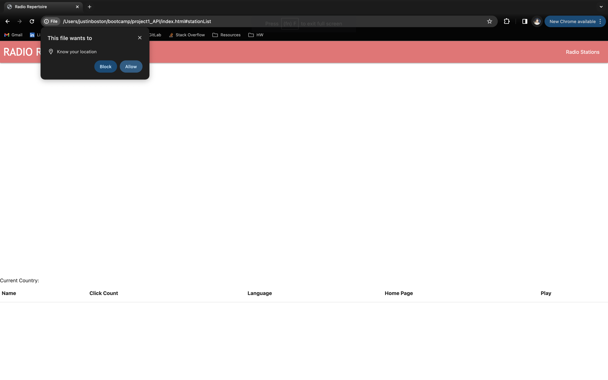
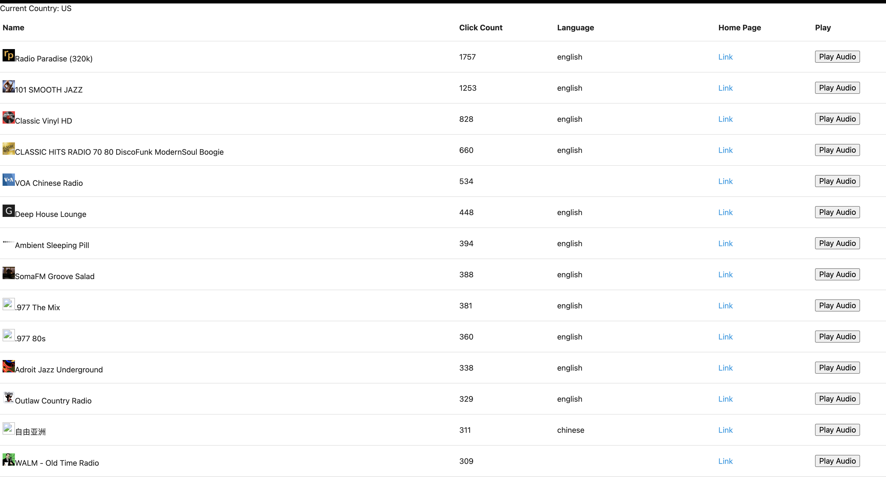

# RADIO REPERTOIRE

## Description

For this full stack bootcamp project, our team was tasked with creating an interactive online application that satisfies the below acceptance criteria. 
<ul>
<li>Uses at least two server-side APIs.</li>
<li>Uses client-side storage to store persistent data.</li>
<li>Uses at least one modal </li>
<li>Uses a CSS framework other than Bootstrap.</li>
<li>Is interactive (accepts and responds to user input).</li>
</ul>

## Concept

Radio Repertoire is the perfect website for a traveler & music lover! For those whose taste in music extends beyond the linguistics of their native language, our Radio Brower application utilizes your current location to load a list of local radio stations. It is designed to satisfy the below user story. 

## User Story

AS a traveler with a unique taste in music
I WANT to expand my music repertoire by getting new song recommendations 
SO that when I travel to a new region, I am more familiar with the local music scene

## Usage

To utilize the Radio Repertoire application, please allow the site to know your current location by clicking "Allow" on the window popup.

Once location services are allowed, the application will automatically load a map centering on your current location, along with list of radio stations based on your current country. After browsing through the list of local stations, please select the <b>Play Audio</b> button to listen to the station of your choosing. 

## Technologies Used

<ul>
<li>HTML</li>
<li><a href="http://materializecss.com">Materialize CSS Framework</a></li>
<li>JavaScript</li>
<li><a href="https://developer.mapquest.com/documentation/geocoding-api">MapQuest Geocoding API</a></li>
<li><a href="https://www.radio-browser.info/">Radio Browser API</a></li>
<li>Git and GitHub</li>
</ul>

## Screenshots

## Links

<ul>
<li><a href="https://katvela24.github.io/project1_API/">Deployed Radio Repertoire Application</a></li>
<li><a href="https://github.com/katvela24/project1_API">GitHub Repo</a></li>
</ul>

# Contributors

<ul>
<li><a href="https://github.com/katvela24">Katherine Velasco</a></li>
<li><a href="https://github.com/kitasauce">Andrew Zubac</a></li>
<li><a href="https://github.com/justinboston">Justin Boston</a></li>
</ul>

## Liscense

Please refer to the MIT LISCENSE in the repo.
